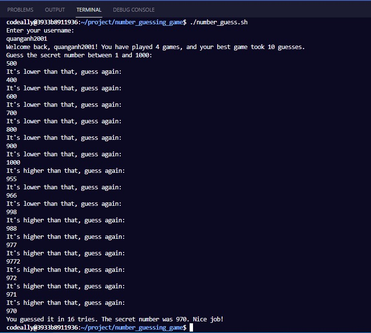
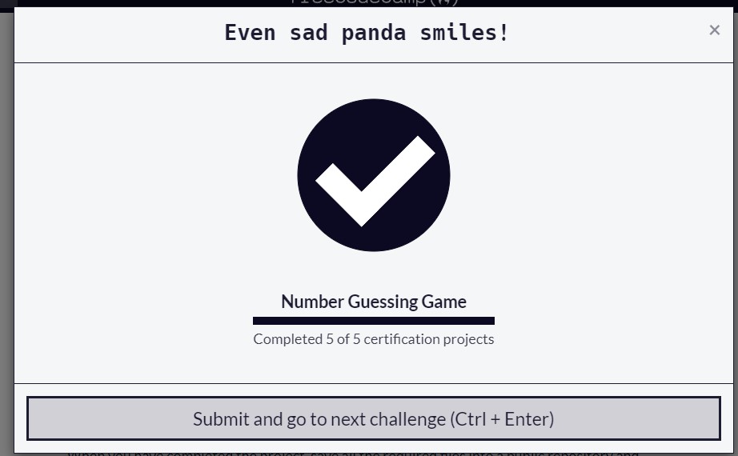

# 1. Prepare database
```sql
psql --username=freecodecamp --dbname=postgres
CREATE DATABASE number_guess;
\c number_guess

CREATE TABLE users(
	user_id SERIAL NOT NULL, 
	username VARCHAR(22) UNIQUE NOT NULL,
	frequent_games INTEGER DEFAULT 0 NOT NULL
);

CREATE TABLE games(
 	game_id    SERIAL NOT NULL, 
 	user_id    INTEGER NOT NULL, 
 	best_guess INTEGER DEFAULT 0 NOT NULL
);
```

# 2. Primary Key and Foreign Key assignment
```sql
ALTER TABLE users ADD PRIMARY KEY (user_id)
ALTER TABLE games ADD PRIMARY KEY (game_id)
ALTER TABLE games ADD FOREIGN KEY (user_id) REFERENCES users (user_id)
```

# 3. Compact sql db schema into number_guess.sql
```txt
quit
pg_dump -cC --inserts -U freecodecamp number_guess > number_guess.sql
```

# 4. Prepare git directory

`mkdir number_guesssing_game`

`cd number_guesssing_game`

`git init`

`git checkout -b main`

# 5. Prepare shell script file

`touch number_guess.sh`

`git add number_guess.sh`

`git commit -m "Initial commit"`

`chmod +x number_guess.sh`

`git add number_guess.sh`

`git commit -m "refactor: give executable permissions on number_guess.sh"`

# 6. Copy scipt line by line, meanwhile commit changes on terminal  
1. Create function input name & input number guess
- At number_guess.sh file : Copy function `INPUT_NAME()` & `INPUT_GUESS()`
- At terminal, type:

`git add number_guess.sh`

`git commit -m "feat: create function to input name and input number guess"`

2. Create function to check input guess number
- At number_guess.sh file : Copy function `CHECK_ANSWER()`
- At terminal, type :

`git add number_guess.sh`

`git commit -m "feat: create function to check the guess number"`

3. Create function to save the user
- At number_guess.sh file : Copy function `SAVE_USER()`
- At terminal, type :

`git add number_guess.sh`

`git commit -m "feat: create function to save new user"`

4 .Create function to save the game
- At number_guess.sh file :  copy function SAVE_GAME()
- At terminal, type:

`git add number_guess.sh`

`git commit -m "feat: create function to save the game"`

Last step: Run The Script and enjoy the result!

See the full solution here: [Bash script file](number_guess.sh) and [PostgreSQL file](number_guess.sql)

My result:



Finished all projects!


